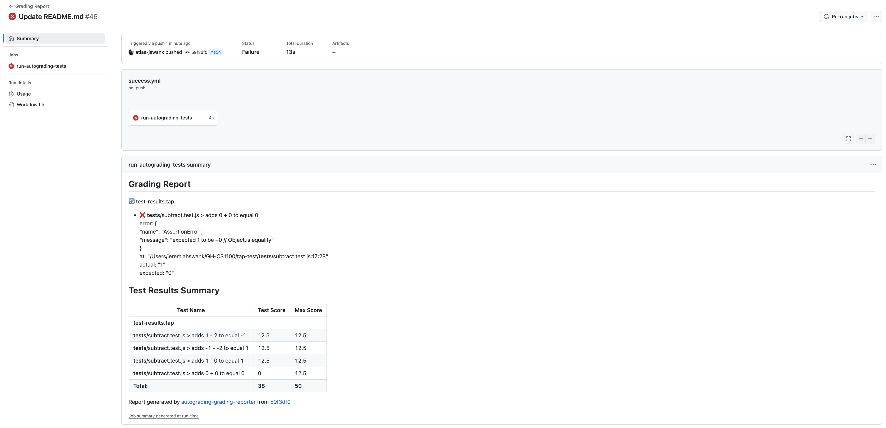
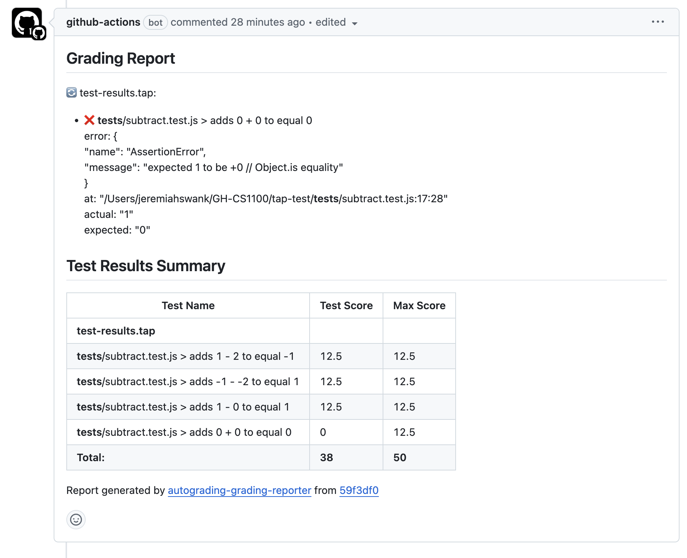

## Atlas School Autograding Reporter

This repository is a fork of [https://github.com/classroom-resources/autograding-grading-reporter](https://github.com/classroom-resources/autograding-grading-reporter)

## Overview

**Atlas School Autograding Reporter** is a plugin for GitHub Classroom's Autograder. Use it to report the results of the test execution to students and GitHub Classroom. It supports autodetecting standard file outputs for common testing frameworks.

## Supported Formats

### TAP (Test Anything Protocol)

[Test Anything Protocol](https://testanything.org/) is a standard format that is supported by many libaries across common languages. The github action will scan for tap files in the workspace and parse the result into a report. Example TAP output:

To find a library that supports TAP output for a given language, checkout [TAP Producers](https://testanything.org/producers.html)

### TRX (Visual Studio Test Result)

TRX files are test result files that are created either by Microsoft Visual Studio or Microsoft MSTest. Visual Studio is a program used to develop Windows software, while MSTest is a command-line utility to run various unit tests for Visual Studio. The test results from these unit tests are saved in a TRX file and in the XML format. The TRX format is a format common in c#.

## Setup

### Environment Variables

| Env Name               | Description                                     | Required | Default |
| ---------------------- | ----------------------------------------------- | -------- | ------- |
| MAX_POINTS       | Total number of points the assignment is worth  | No       | 100     |
| GLOBAL_PATTERN | File pattern to locate test result files | No      |  **/*.{tap,trx}  |
| GLOBAL_IGNORE | File pattern to ignore when locating result files | No      |  node_modules/**  |

### Usage

1. Add the GitHub Classroom Reporter to your workflow.

```yaml
name: Grading Report
on:
  - push
  - workflow_dispatch
permissions:
  checks: write
  actions: read
  contents: read
  pull-requests: write
jobs:
  run-autograding-tests:
    runs-on: ubuntu-latest
    steps:
      - name: Checkout
        uses: actions/checkout@v4
      - name: Grade Report
        uses: atlas-school-classroom/autograding-tap-reporter@main
        env:
          MAX_POINTS: 50
          GLOBAL_PATTERN: "**/*.tap"
          GLOBAL_IGNORE: "node_modules/**"
```

## Output

### Console Output

The action will output the report directly to the console in the github action. It will also fail the action if there are any failing tests


### Job Summary

The report will be displays on the job summary for the github action.



### Pull Request

If there is an open pull request for the current branch the report will be added as a comment to the pull request.



### Development

[pnpm](https://pnpm.io) is used to manage dependencies. To install dependencies run:
```
pnpm install
```

The github action runs the `dist/index.js` file. To run code in a github action you must build the code and then commit the changes to the dist folder. To build the code run:

```
pnpm build
```

Once built you can push to gihub to run a sample worflow. There a workflow setup for testing the action. When pushing to the repository it will automatically run.

**IMPORTANT:** In order to not impact students do not push to the main branch for testing. All student assignments run off the main branch. Develop in a feature branch and then only push to main when code has been tested and is ready for student assignments.
